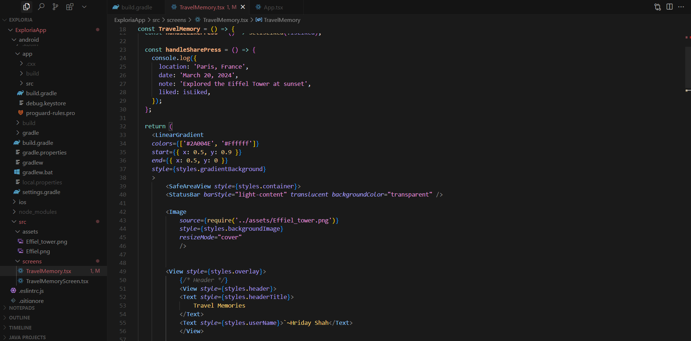
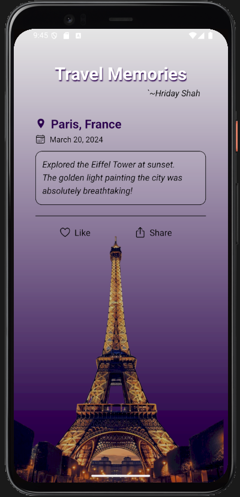
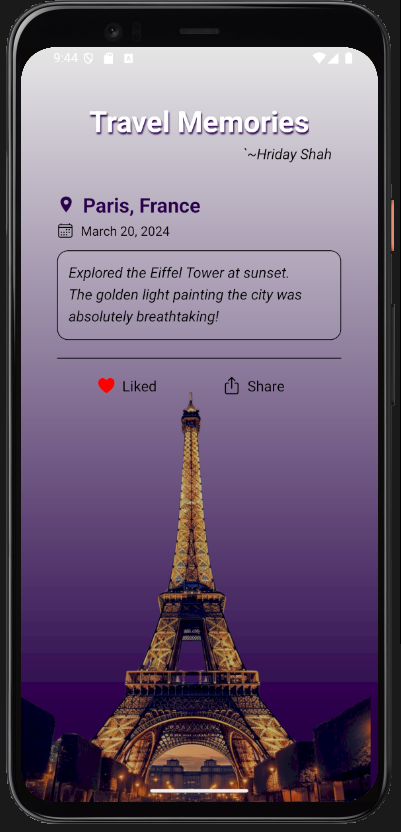

# ExploriaApp - Travel Memories

A simple and beautiful React Native app to store and display your favorite travel memories. This screen showcases a memory from **Paris, France**, with an image, date, and interactive like/share feature.

---

## 📱 Screenshots

### VS Code Debug View


### Memory Screen - Initial


### Memory Screen - After Like



---

## 🔧 Features

- Displays a travel memory card with:
  - Location, date, and notes
  - Interactive **Like** button (toggles icon and text)
  - Share button
  - Beautiful background image
- Responsive UI styled with custom stylesheets
- Built with **React Native + TypeScript**

---

## 🚀 How to Run

### Prerequisites

- Node.js
- React Native CLI
- Android Studio or Xcode set up for emulator or real device testing

### Clone the Repo

```bash
git clone https://github.com/yourusername/ExploriaApp.git
cd ExploriaApp
```

### Install Dependencies

```bash
npm install
```

---

## 🛠️ Start the App

### Step 1: Start Metro Server

```bash
# Using npm
npm start

# OR using Yarn
yarn start
```

### Step 2: Build & Run the App

#### ▶️ Android

```bash
npm run android
# OR
yarn android
```

#### 🍏 iOS (macOS only)

First time or after native updates:

```bash
bundle install
bundle exec pod install
```

Then:

```bash
npm run ios
# OR
yarn ios
```

Alternatively, you can use Android Studio or Xcode.

---

## ✏️ Modify the App

Open `App.tsx` and make changes. Thanks to [Fast Refresh](https://reactnative.dev/docs/fast-refresh), changes reflect instantly.

To manually reload:

- **Android**: <kbd>R</kbd> twice or <kbd>Ctrl</kbd>/<kbd>Cmd</kbd> + <kbd>M</kbd>
- **iOS**: Press <kbd>R</kbd> in the iOS Simulator

---

## 🎉 You're All Set!

You’ve successfully run your first React Native app! 🥳

---

## 💡 What's Next?

- [Integrate into an existing app](https://reactnative.dev/docs/integration-with-existing-apps)
- [Explore the docs](https://reactnative.dev/docs/getting-started)

---

## 🛠️ Troubleshooting

Check the [Troubleshooting Guide](https://reactnative.dev/docs/troubleshooting) if you run into issues.

---

## 🗂️ Folder Structure

```
ExploriaApp/
├── android/
├── ios/
├── src/
│   ├── assets/
│   │   ├── Eiffel_tower.png
│   │   └── Eiffel.png
│   └── screens/
│       ├── TravelMemory.tsx
│       └── TravelMemoryScreen.tsx
├── App.tsx
└── ...
```

---

## 👨‍💻 Author

- **Hriday Shah**

---

## 📄 License

This project is open-source and free to use.

